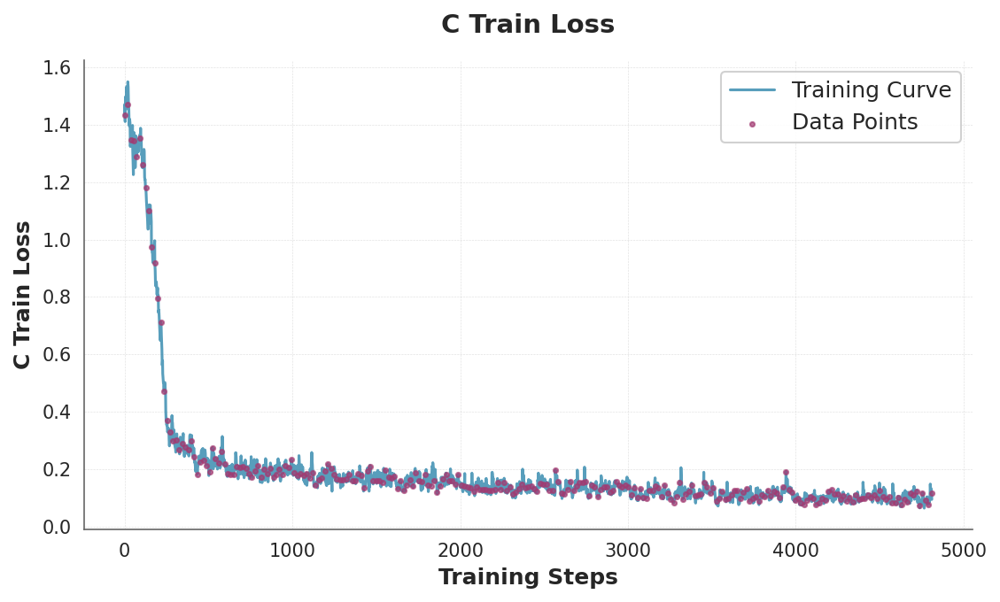

# Jittor 实现浙江大学 **异构专家模型 MoA**

原文地址：[MoA](https://arxiv.org/abs/2506.05928) 

主要工作点：
- 使用 Jittor.nn.Module 实现原文中的各个模块，包括 **LLaMA-3-8B** 模型，**Tokenizer**、微调模块 **LoRA**、**Prompt**、**PAdapter**，异构和同构路由机制，以及可训练的阈值。
- 实现 **LLM** 在训练和推理阶段的不同行为，包括梯度的 start 和 stop，推理时的 KV Cache 和 token_weight、type_weight Cache，
- 配合 Mpirun 的分布式模块，包括分布式初始化，分布式指标记录器
- Dataset 模块，包括 Prompt 的设计，输入的格式化和 Dataset 的初始化
- 训练和推理的实现
  - 训练：混合精度训练、tensorboard 日志，终端输出的日志，log.txt 输出的日志，早停策略，微调模块权重的保存
  - 推理：结果的保存，token_weight、type_weight 的输出，热力图的绘画。

## 实验结果展示

### 不同种子下的适配器类型权重热力图对比

我们使用不同的随机种子训练模型，并对比异构专家模型中不同专家类型权重（type_weight）的分布模式。以下是不同种子下的热力图对比：

| 专家权重图（seed000） | 专家权重图（seed125） |
|:-----------------:|:-------------------:|
|  |  |

大体结构较为一致，符合论文结果

### 不同种子下的 token 阈值热力图对比

| token 阈值图（seed000） | token 阈值图（seed125） |
|:-----------------:|:-------------------:|
|  |  |


### 训练迭代图

| train_loss 图（seed000） | train_loss 图（seed125） |
|:-----------------:|:-------------------:|
|  |  |

| val_loss 图（seed000） | val_loss 图（seed125） |
|:-----------------:|:-------------------:|
|  |  |


## 环境信息

### 安装环境

```
conda env create -f environment.yml
sudo apt install openmpi-bin openmpi-common libopenmpi-dev # 安装 OpenMpi 用于分布式训练
```

### Jittor 报错一

```
CUDA found but cudnn is not loaded: Develop version of CUDNN not found, please refer to CUDA offical tar file installation: https://docs.nvidia.com/deeplearning/cudnn/install-guide/index.html#installlinux-tar or you can let jittor install cuda and cudnn for you: python3.8 -m jittor_utils.install_cuda
```

**原因**：缺少 cuDNN 开发包
**解决**：

```
python3.8 -m jittor_utils.install_cuda
```

### Jittor 报错二

```
raise RuntimeError(f"MD5 mismatch between the server and the downloaded file {file_path}") RuntimeError: MD5 mismatch between the server and the downloaded file /root/.cache/jittor/cutlass/cutlass.zip
```

**原因**：Jittor 源码中，安装 `cutlass` 的版本过旧

**解决**：

在容器中找到 `vlhr.py`，修改函数 `install_cutlass` 里的 `url` 为

```
https://cg.cs.tsinghua.edu.cn/jittor/assets/cutlass.zip
```

# 模块细节

## 分布式训练实现

### 核心组件

#### 1. **分布式初始化模块** (`Utils/misc.py`)

| 函数/类 | 主要功能 |
|:--------|:---------|
| `init_distributed_mode(args)` | 初始化分布式训练环境，检测MPI进程，设置GPU设备，配置分布式参数 |
| `setup_for_distributed(is_master)` | 设置分布式环境，控制主进程的打印输出 |
| `save_on_master()` | 仅在主进程保存文件，避免多进程冲突 |

#### 2. **分布式指标记录器** (`Utils/misc.py`)

| 类/函数 | 主要功能 |
|:--------|:---------|
| `SmoothedValue` | 单个指标的平滑值跟踪器，支持滑动窗口统计，多进程间数据同步 |
| `MetricLogger` | 分布式指标记录器，管理多个指标，支持进程间同步和状态保存 |

#### 3. **分布式数据加载** 

> **注意**：Jittor 的 Dataset 具有分布式加载数据的功能。

### 使用方式

#### 多进程分布式训练

```bash
mpirun -np 2 python Math.py
```

## 模型的实现
主要文件夹：Models

| Class or def | File | 主要功能 |
|:-------------|:-----|:---------|
| `Module` 类 | `Blok.py` | 继承自 `jt.nn.module`，做了些许修改，只要是将对 KV Cache 和 `token_weight`、`type_weight` Cache 的销毁和初始化写到了 `train()` 和 `eval()` 中，以及增添了用于重新初始化权重的方法 `init`。 |
| `RMSNorm` 类 | `Blok.py` | 实现 RMSNorm 归一化 |
| `Gamma` 类 | `Blok.py` | 实现可训练的阈值，如果 `if_trainable=False`，会返回给定的 Gamma，如果 `if_trainable=True`，在这个 Gamma 上会乘上一个经过 sigmoid 激活的一维线形层输出。 |
| `Router` 类 | `Blok.py` | 实现SwiGLU路由器，用于MoA架构中的适配器类型选择。包含三层线性变换（`w1`, `w2`, `w3`），使用SwiGLU激活函数进行非线性变换，为不同类型的适配器（LoRA、Prompt、PAdapter）提供路由决策。 |
| `MOELoraLayer` 类 | `Blok.py` | 实现多头专家LoRA层，支持多个专家并行处理。包含专家权重计算、稀疏路由、可训练阈值等功能，支持Hydra MoE模式和非对称LoRA结构。 |
| `PAdapterLayer` 类 | `Blok.py` | 实现并行适配器层，在原始FFN基础上添加并行分支。支持多头专家结构、稀疏路由、可训练的阈值。 |
| `FeedForward` 类 | `Blok.py` | 实现SwiGLU前馈网络，包含三个线性层（`w1`, `w2`, `w3`）。支持LoRA集成，可选择性地在 `FFN_UP`、`FFN_GATE`、`FFN_DOWN` 位置应用LoRA。 |
| `Attention` 类 | `Blok.py` | 实现多头注意力机制，支持LoRA和Prompt Tuning。包含KV Cache管理、旋转位置编码（RoPE）、分组查询注意力（GQA）等功能。 |
| `TransformerBlock` 类 | `LLM.py` | 实现Transformer块，组合Attention和FeedForward模块。支持多种适配器类型（LoRA、Prompt、PAdapter）的集成，实现适配器类型路由和推理时的专家权重日志缓存管理。 |
| `LLaMA` 类 | `LLM.py` | 实现LLaMA模型，包含多个TransformerBlock层。提供训练和推理的完整接口。 |
| `LLaMA_adapter` 类 | `LLaMA_Adapter.py` | 实现LLaMA适配器封装类，整合模型加载、训练、推理功能。支持预训练权重加载、损失计算、文本生成、专家权重日志保存等功能。 |
| `ModelArgs` 类 | `ModelArgs.py` | 定义LLaMA模型的所有配置参数，包括基础架构参数、训练参数、参数高效微调参数（LoRA、Adapter、Prompt）、混合专家系统参数等，支持MoA架构的完整配置。 |
| `Tokenizer` 类 | `Tokenizer.py` | 基于Tiktoken实现的分词器，支持文本编码解码、特殊Token处理、对话格式编码等功能。提供词汇表管理、停止Token设置、BPE分词等核心功能。 |
| `apply_rotary_emb` 函数 | `utils.py` | 实现旋转位置编码（RoPE）的应用，将位置信息编码到Query和Key向量中。 |
| `precompute_freqs_cis` 函数 | `utils.py` | 预计算旋转位置编码的频率，生成cos和sin值。 |
| `repeat_kv` 函数 | `utils.py` | 重复Key和Value张量，用于分组查询注意力（GQA）机制。 |
| `sample_top_p` 函数 | `utils.py` | 实现top-p采样策略，用于文本生成时的概率采样。 |

## 训练和推理

### 训练

`Math.py` 在数学数据集上训练模型，复现论文在数学方面的结果

#### 流程

获取参数 `prepare_args()` $ \to $ 分布式初始化 $ \to $  打印参数 $ \to $ 设置随机种子 $ \to $ 创建模型 $ \to $ 统计可训练参数量 $ \to $ 进入微调函数 `finetune` $ \to $ 加载 `Tokenizer` $ \to $ 加载训练和验证集 $ \to $ 创建优化器和早停器 $ \to $ 判断是否断点续训，如果是，加载缓存信息到模型、优化器和早停器中 $ \to $ 开始训练 $ \to $ 结束训练

#### 一轮训练的细节 `engine_finetune.py`

输入：模型、训练数据和验证数据、优化器、SummaryWriter、早停器 `EarlyStopper` 、指标记录器 `MetricLogger`、早停验证间隔、断点续训的 Epoch 和 data_iter_step。

流程：loss 计算 $ \to $ 优化 $ \to $ 同步和更新指标 $ \to $ 打印日志 $ \to $ 在 SummaryWriter 中写入指标信息 $ \to $ 如果到检查点，临时关闭梯度，计算验证集loss，更新验证集指标，判断是否早停


### 推理流程

分布式初始化 $ \to $ 手动加载测试集数据 $ \to $ 加载模型，并调成 `eval` 模式 $ \to $ 分批生成文本并写入 $ \to $ 判断是否获取专家权重信息和不同 token 阈值信息，是，则在推理时同步提取相关数据，保存为 `.pkl` 文件。


